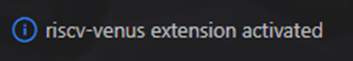

## RISC-V Tool Chain 操作方法
### Let high-level-language compile to assembly
1. 撰寫 code

2. 至此 [Website](https://godbolt.org/) 將 code compile 完成

3. 貼上code，並選擇 <mark><strong>RISC-V (32-bits) gcc (trunk)</strong></mark>

4. 將 assembly 存至 asm 資料夾，名稱隨意(ex: code.asm or code.s)
> 即使用VScode於asm下建立一個code.asm，將compile出來的code貼上

5. 將函數header所含的括號(包含參數)移除

|Before|After|
|-|-|
|<code>int adder (int a, int b, int c):</code>|<code>int adder:</code>|

### Using venus (assembler)
6. 在VScode中使用<strong>control+shift+p</strong>打上<strong>venus</strong>，點擊<strong>Venus: Activate Extension</strong>，確認右下角出現 

7. 開啟code.asm檔案，點左方工具列<strong>Run and Debug (control+shift+D)</strong>，點擊<strong>執行</strong>

8. 依路徑VENUS OPTIONS->Views找到Assembly，點擊<strong>Assembly</strong>

9. 在asm資料夾中創一個assembly.txt(檔名一定要相同)，將Assembly內容複製進txt中

### Let assembly code turns into machine-code
10. 啟動<strong>asm2sv.exe</strong>

### Notice
* 小提醒：asm資料夾中記得清理不必要檔案