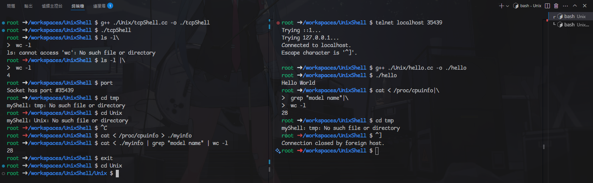

## Tcp Shell
---
### Server
* Compile and execute <strong>tcpShell.cc</strong> file
* If you want to search tcp-port opened <strong>(Random port)</strong>, type <strong>port</strong> in shell.
* You can try control-c signal, it will kill process executed (I hope it will)
* If you want to leave the shell, type <strong>exit</strong>.
---
### Client
> I use telnet to test tcp function
* If you want to leave the shell, type <strong>^]</strong>
* You <strong>can't use control-c signal in client</strong>, it will meet some trouble, after you type it, the only thing can do is leaving it. (I don't know how to handle this bug)
---
### Request in HW2
* The shell <strong>doesn't has GUI</strong>, only command.
* You can execute whole commands in <strong>Homework 2.pdf</strong>
* This tcpShell accept commands more than one line with <strong>\\</strong> in the end of each line.
---
### Demo

|Left|Right|
|-|-|
|Server|Client|

* As you can see, the shell <strong>doesn't has cd</strong>, "Unix" directory is existed, but can't go into it.
* If you wana type command more than one line, remember to <strong>type one space after first line at first</strong>.
* If command isn't executed perfectly, the arrow will turn white into red. (Try to imitate this ubuntu image)
---
