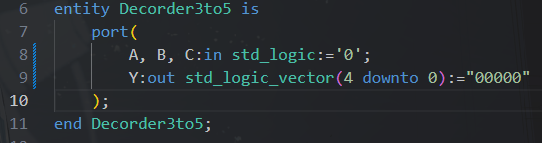
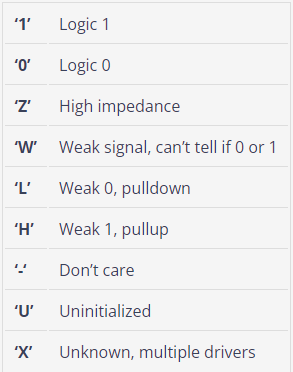
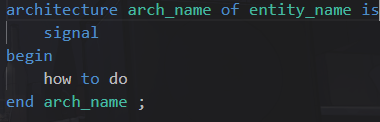

# rule：

* 此<mark>硬體描述語言</mark><strong>不區分大小</strong> 
* 引入library：<code>library IEEE</code>
* 單一binary使用<mark>''</mark>，多個binary使用<mark>""</mark>
* 八位元使用<code>o""</code>，十六位元使用<code>x""</code>

<fieldset>
    <legend><strong>必引入的三行：</strong></legend>
    <code>use IEEE.std_logic_1164.all;</code> 
    <code>use IEEE.std_logic_arith.all;</code> 
    <code>use IEEE.std_logic_unsigned.all;</code>
</fieldset>

## entity：
* 功能：描述電路的輸入、輸出
* 格式： 

|名字|細節|
|----|----|
|entity|開始描述電路長相|
|end|結束描述電路長相|
|取名|開始、結束，都要稱呼名字，且該檔案名字要與名字相同|
|port();|描述電路輸入、輸出|
|in, out, buffer|輸入（單向）, 輸出（單向）, (可接受輸入，亦可輸出，雙向)|
|std_logic|標準輸入，可接受以下幾種值|
|std_logic_vector|宣告比較多的std_logic，使用()取用裡面的值，順序很重要|
|:=|在 port 內預先賦值|

* 結尾要分號

## architecture

* 功能：描述電路內部訊號
* 格式： 

|名字|功能|
|----|----|
|arch_name|描述電路架構的名字|
|entity_name|描述哪個電路|
|signal|除了外部訊號(輸入、輸出)的內部訊號|
|how to do|描述電路如何工作|

## how to do

### 1. Dataflow

1. Definition：資料流範式著重於系統中不同元件之間的資料流。它描述了資料如何透過並發操作移動和處理。  
2. Concurrent Execution: 描述同時發生的操作。 
3. Signal Assignment: 使用訊號來表示資料流，其中訊號的變化會透過系統傳播。 
4. Structural Representation: 通常類似於電路圖，顯示元件如何連接以及資料如何在它們之間流動。 
5. Example Constructs: 使用諸如when、with和訊號分配 ( &lt;=) 之類的構造。 
6. Use Case: 適合描述組合邏輯和系統，其中輸入和輸出之間的關係可以表示為方程式。 

### 2. behavior